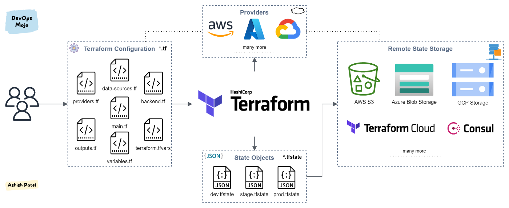
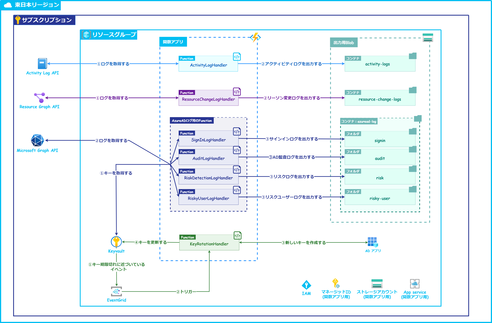

# Cloud IAC

## IAC Overview

### 1. What is IAC

Managing infastructure by code

### 2. Benefits

- IaC boosts productivity through automation
- Consistency in configuration and setup
- Minimizing risk of human error
- Increased efficiency in software development

## Comparison

### 1. Company which provides IAC

|                    | HashiCorp          | AWS            | Microsoft Azure               |
| ------------------ | ------------------ | -------------- | ----------------------------- |
| IaC                | Terraform          | CloudFormation | Azure Resource Manager (Sida) |
| Supported Platform | AWS, Azure, etc... | AWS only       | Azure only                    |
| CDK Support?       | o                  | o              | x                             |

### 2. Terraform vs CloudFormation comparison

|                            | Terraform    | CFN         |
| -------------------------- | ------------ | ----------- |
| Language                   | TF,JSON      | YAML, JSON  |
| State Management           | Self Managed | AWS Managed |
| Failed deployment behavior | Pause        | Rollback    |
| Modularity                 | o            | x           |
| Multi Cloud                | o            | x           |
| Local Script               | o            | x           |

### 3. Template file vs CDK

|                            | Template file | CDK |
| -------------------------- | ------------- | --- |
| Constructing Level Support | x             | o   |

## Terraform overview

#### 1. How terraform works



#### 2. Folder structrure

```shell
$ directory
.
├── modules/
    ├── main.tf
    ├── variables.tf
    ├── outputs.tf
├── main.tf
├── providers.tf
├── variables.tf
├── terraform.tfvars
├── terraform.tfstate
├── *.auto.tfvars
```

#### 3. Best practices

- Use a consistent file structure across your projects.

- Use modules wherever possible.

- Use a consistent naming convention.

- Use a consistent format and style.

- Hold your state file remotely, not on your local machine.

- Avoid hardcoding variables.

## Demo



#### 1. Modules splitting

- Function App (AWS Lambda equivalent)
- Blob Storage (AWS S3 equivalent)
- KeyVault (AWS Secret Manager, System Parameter Store equivalent)
- Resource Group
- Active Directory App
- Event Grid (AWS EventBridge equivalent)

#### 2. Deployment demo

```shell
$ terraform plan
```
